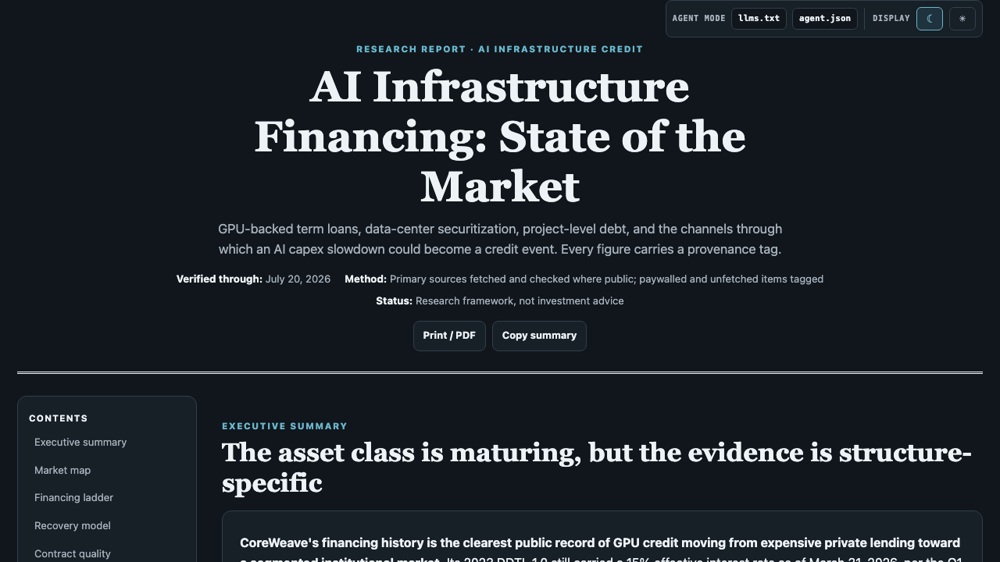
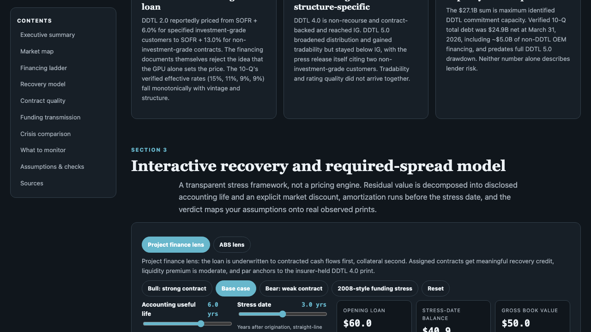
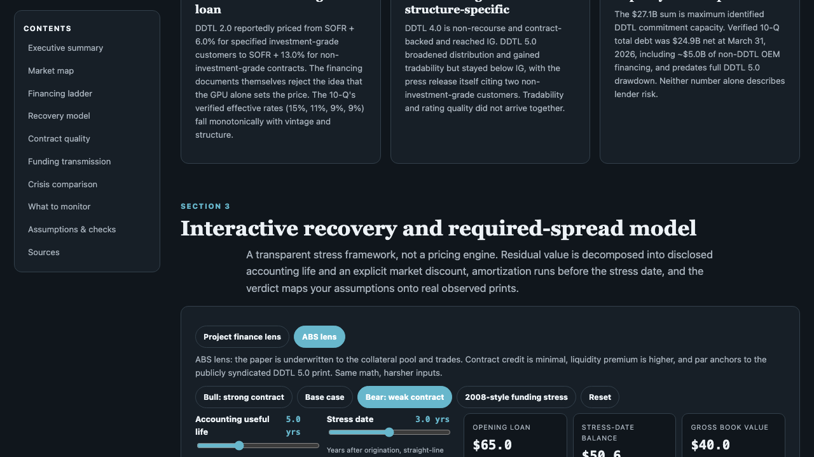
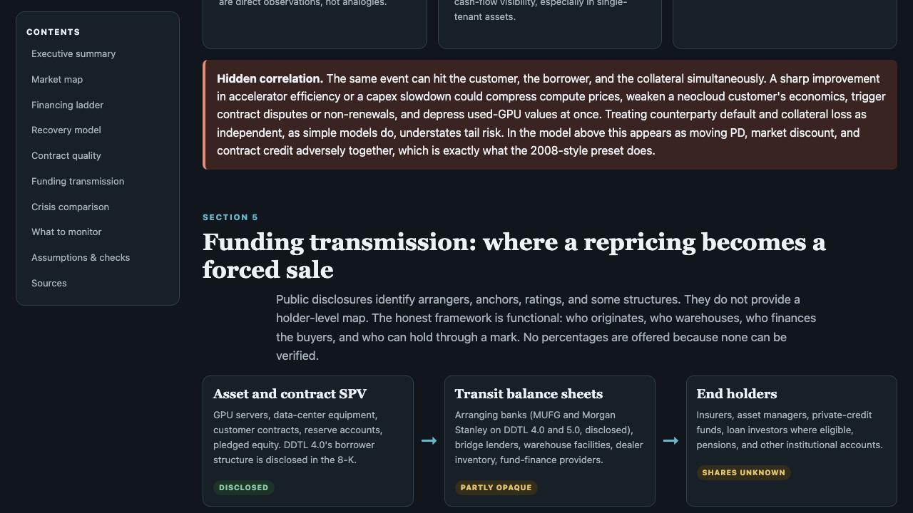

# AI Infrastructure Financing: State of the Market

An interactive, quantitative, and research-backed report on GPU-backed term loans, data-center project finance, and the credit transmission channels that link an AI capex slowdown to fixed-income asset classes. Built by a former institutional rates and macro trader to analyze where physical AI assets transition from hyper-growth collateral to distressed liquidation blocks.



## Interactive Walkthroughs
- **Short Walkthrough (60s):** [Watch on YouTube](https://www.youtube.com/watch?v=iameFULncF8) — Fast demonstration of the interactive recovery and required-spread pricing model.
- **DetailedWalkthrough (3.5 min):** [Watch on YouTube](https://www.youtube.com/watch?v=VM3f3d4pjOw) — Comprehensive dive into the underwriting structures, CoreWeave financing ladder, and liquidity transmission mechanics.

---

## Technical Approach & Quantitative Framework

This repository serves as a localized, high-fidelity quantitative analysis layer. It models the cash flows, credit risk, hardware depreciation schedules, and liquidation paths of high-end AI compute installations (specifically NVIDIA H100/H200/B200 clusters).

### 1. The CoreWeave Financing Ladder
The report deconstructs the actual credit facilities and collateral structures used by specialized GPU cloud providers:
- **Equipment-Backed Term Loans:** Structured debt secured directly by specific physical GPU assets.
- **Project Finance / ABS:** SPVs designed to isolate cash flows from long-term enterprise contracts.
- **The Liquidation Waterfall:** Underwriting metrics, loan-to-value (LTV) constraints, and advance rate mechanics.

### 2. Interactive Recovery & Required-Spread Model
An embedded cash-flow simulator that allows operators to stress-test debt structures under various default and depreciation scenarios:
- **Depreciation Curves:** Models hardware residual value using customized discount rates, physical age, and hardware lifecycle decay.
- **Credit Risk Pricing:** Formulates required credit spreads based on probability of default (PD), liquidation costs, secondary market liquidity, and contract coverage.
- **Dual-Lens Evaluation:** Toggle between a **Project Finance Lens** (prioritizing contract durability and enterprise cash flows) and an **ABS Lens** (prioritizing pool-level liquidation recovery and hardware liquidation values).



---

## Visual Walkthrough

### Underwriting Presets & Scenarios
Test the resilience of these facilities across different market regimes:
- **Bull (Strong Contract):** High contract coverage, low default probability, and robust hardware residual values.
- **Base Case:** Reconciles current market-standard pricing with conservative depreciation.
- **Bear (Weak Contract):** Severe hardware discount rates, collapsed secondary market liquidity, and minimal contract coverage leading to deep recovery impairment.



### Credit Transmission Channels
The model demonstrates how localized distress in GPU cloud providers propagates to broader markets:
- **Specialized GPU Cloud Default:** Forced liquidation of hardware blocks.
- **The Secondary Market Glut:** Depreciation acceleration as secondary bids collapse under high supply.
- **Financing Transmission:** Spreads widen, capital calls trigger, and securitized credit pools (ABS/loans) face downgrades.



---

## Local Run Instructions

To view, interact with, or extend the analysis model locally:

1. Clone this repository:
   ```bash
   git clone https://github.com/DanDo385/ai-physical-infra-debt-analysis.git
   cd ai-physical-infra-debt-analysis
   ```

2. Start a local HTTP server:
   ```bash
   python3 -m http.server 8080
   ```

3. Open your browser and navigate to:
   ```text
   http://localhost:8080/ai_infra_financing_report.html
   ```

---

## Sources & Verification Status
All figures, covenants, and capital structures are provenance-tagged and verified against actual regulatory filings, credit agreements (including CoreWeave, Lambda Labs, and Crusoe Energy facilities), and institutional research.
